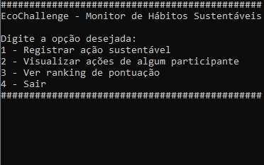
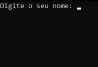
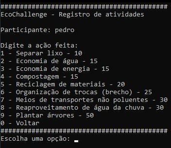
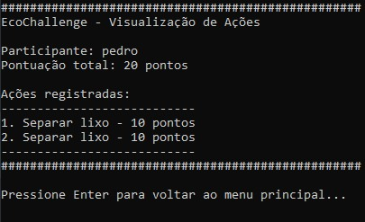
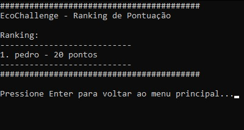

# README - EcoChallenge

## Sobre o Projeto
O EcoChallenge é um sistema de monitoramento de hábitos sustentáveis desenvolvido em C. O programa permite que usuários registrem suas ações ecológicas, visualizem suas atividades e comparem suas pontuações com outros participantes através de um ranking.

## Funcionalidades
### Menu Principal


- Registrar ação sustentável
- Visualizar ações de um participante
- Ver ranking de pontuação
- Sair
  
### Registro de Nome


Entrada do nome do usuário

### Ações Sustentáveis Disponíveis


1. Separar lixo (10 pontos)
2. Economia de água (15 pontos)
3. Economia de energia (15 pontos)
4. Compostagem (15 pontos)
5. Reciclagem de materiais (20 pontos)
6. Organização de trocas (brechó) (25 pontos)
7. Meios de transportes não poluentes (30 pontos)
8. Reaproveitamento de água da chuva (30 pontos)
9. Plantar árvores (50 pontos)


### Vizualizar o Histórico de Ações


Acesse para ver o histórico de ações de qualquer usúario


### Ranking de pontuação dos jogadores


Mostra a pontuação de todos os jogadores em forma de um ranking

## Estrutura do Sistema
- O sistema armazena informações de até 100 usuários
- Cada usuário pode registrar até 15 ações
- As informações são armazenadas temporariamente durante a execução do programa

## Como Compilar e Executar
1. Certifique-se de ter um compilador C instalado (como GCC)
2. Compile o arquivo com o comando:
   ```
   gcc main.c -o ecochallenge
   ```
3. Execute o programa:
   ```
   ./ecochallenge
   ```

## Limitações Atuais
- Os dados não são persistentes e são perdidos quando o programa é encerrado

## Próximas Melhorias Planejadas
- Implementar sistema de persistência de dados usando arquivos

## Autores
- Lorenzo Farias, Bernardo Soares Nunes e Pedro Cabral Buchaim

## Licença
Este projeto é fornecido como código aberto para fins educacionais.
